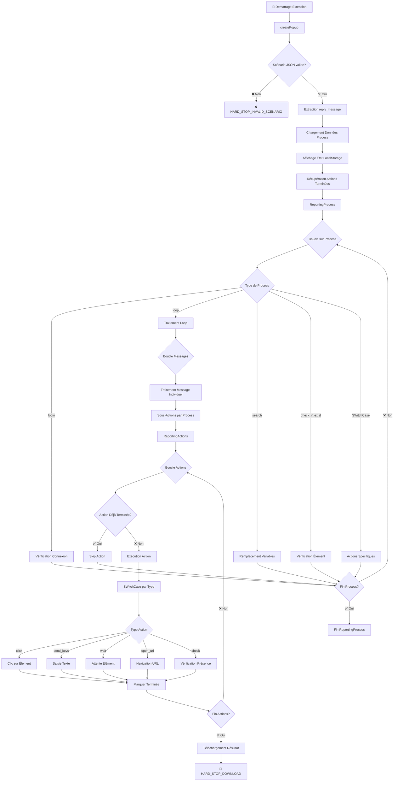
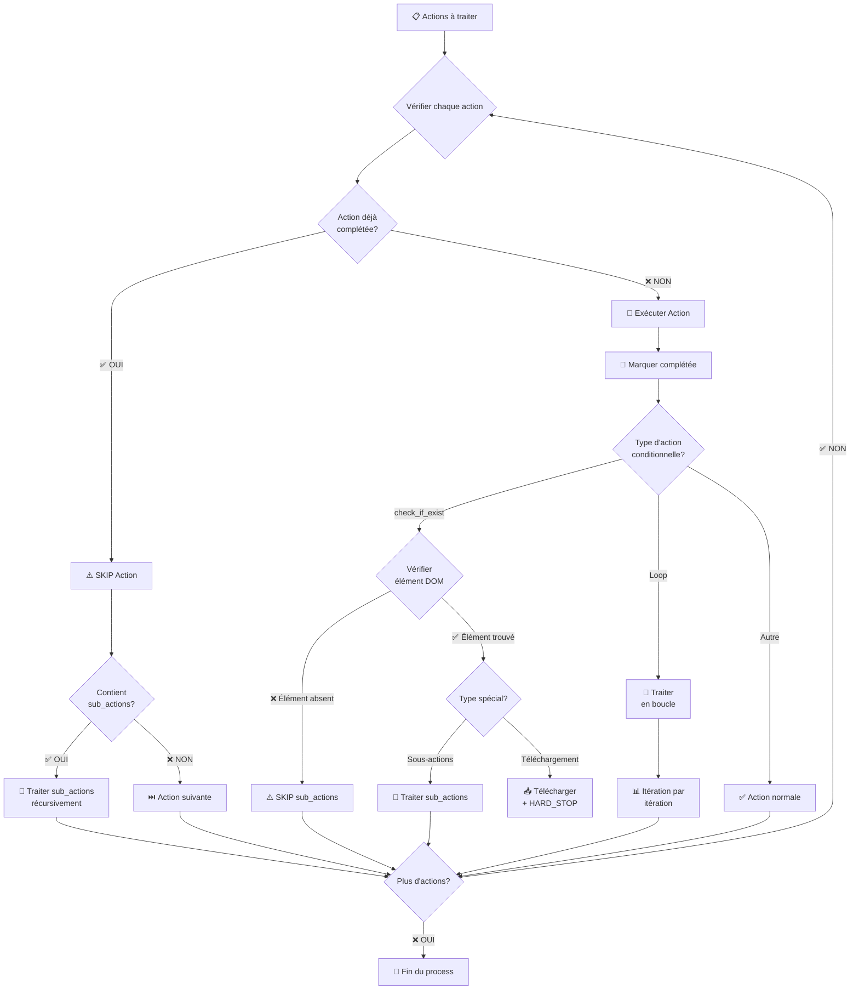

# 📋 Documentation Complète - Extension Chrome Automation

## 🎯 Vue d'ensemble

Cette extension Chrome automatise le traitement de scénarios complexes pour des tâches répétitives sur Gmail et autres services Google. Le système utilise une architecture modulaire avec logging structuré et gestion d'état persistante.

## 🏗️ Architecture Générale

```
┌─────────────────┐    ┌─────────────────┐    ┌─────────────────┐
│   createPopup   │ -> │ ReportingProcess│ -> │ ReportingActions│
│                 │    │                 │    │                 │
│ • Chargement    │    │ • Traitement    │    │ • Exécution     │
│ • Initialisation│    │   Scénario      │    │   Actions       │
│ • Validation    │    │ • Gestion Loop  │    │ • Logging       │
└─────────────────┘    └─────────────────┘    └─────────────────┘
                                                       │
                                                       ▼
                                            ┌─────────────────┐
                                            │   SWitchCase    │
                                            │                 │
                                            │ • Actions       │
                                            │   Spécifiques   │
                                            │ • DOM           │
                                            │   Manipulation  │
                                            └─────────────────┘
```

## 📊 Diagramme de Flux Détaillé



## 🔄 Flux d'Exécution Détaillé

### 1. 🚀 createPopup - Initialisation

**Responsabilités :**
- Chargement du fichier `traitement.json` (scénario)
- Validation du format JSON
- Extraction de la valeur `reply_message`
- Chargement des données persistées (localStorage)
- Affichage de l'état du système

**Étapes clés :**
```javascript
// 1. Chargement scénario
const scenario = await fetch("traitement.json")

// 2. Validation
if (!Array.isArray(scenario)) throw HARD_STOP_INVALID_SCENARIO

// 3. Extraction reply_message
const replyMessageValue = extractReplyMessageValue(scenario)

// 4. Chargement données process
const processData = await chrome.storage.local.get("startProcessData")

// 5. Affichage état système
Logger.data("État LocalStorage", allStoredData)
Logger.completed("Actions terminées", completedActions)
Logger.upcoming("Actions à traiter", upcomingActions)
```

### 2. 🔄 ReportingProcess - Orchestration

**Responsabilités :**
- Traitement séquentiel des processus du scénario
- Gestion des boucles (`loop`)
- Gestion des conditions (`check`)
- Coordination des sous-actions

**Types de processus supportés :**
- `login` : Vérification connexion Gmail
- `loop` : Traitement en boucle de messages
- `search` : Remplacement de variables
- `check_if_exist` : Vérification présence élément

### 3. ⚡ ReportingActions - Exécution

**Responsabilités :**
- Exécution des actions individuelles
- Gestion de l'état (terminé/non terminé)
- Logging détaillé avec couleurs
- Gestion des erreurs et récupération

**États des actions :**
- 🟢 **COMPLETED** : Actions déjà terminées (vert)
- 🔵 **PROCESSING** : Action en cours (bleu)
- ⚪ **À TRAITER** : Actions à venir (gris)

### 4. 🎯 SWitchCase - Actions Spécifiques

**Actions DOM supportées :**

| Action | Description | Paramètres |
|--------|-------------|------------|
| `click` | Clic sur élément | `xpath`, `wait`, `obligatoire` |
| `send_keys` | Saisie de texte | `xpath`, `value`, `wait` |
| `send_keysHumain` | Saisie réaliste | `xpath`, `value`, `wait` |
| `wait` | Attente élément | `xpath`, `timeout` |
| `open_url` | Navigation | `url` |
| `check` | Vérification présence | `xpath`, `wait` |
| `clear` | Effacement contenu | `xpath`, `wait` |
| `focus` | Mise en focus | `xpath`, `wait` |
| `scroll_to_xpath` | Scroll vers élément | `xpath` |
| `dispatchEvent` | Événement personnalisé | `xpath`, `wait` |

## 💾 Gestion d'État Persistante

### LocalStorage Keys

| Clé | Description | Format |
|-----|-------------|--------|
| `completedActions` | Actions terminées par process | `{processName: [actions]}` |
| `profile_email` | Email utilisateur | `string` |
| `startProcessData` | Données d'initialisation | `object` |
| `logs` | Historique des logs | `array` |

### Logique de Déduplication

```javascript
const normalize = (obj) => JSON.stringify(obj).replace(/[\u200B-\u200D\uFEFF\u00A0]/g, "").trim();

const isActionCompleted = (action) => {
    const normalizedAction = normalize({...action, sub_action: undefined});
    return completedActions.some(completed =>
        normalizedAction === normalize({...completed, sub_action: undefined})
    );
};
```

## 🎨 Système de Logging Structuré

### Niveaux de Log

| Niveau | Couleur | Usage |
|--------|---------|-------|
| `🐛 DEBUG` | Gris foncé | Informations détaillées |
| `ℹ️ INFO` | Bleu | Informations générales |
| `✅ SUCCESS` | Vert | Opérations réussies |
| `⚠️ WARNING` | Orange | Avertissements |
| `❌ ERROR` | Rouge | Erreurs |

### Types Spécialisés

| Type | Usage | Couleur |
|------|-------|---------|
| `🚀 PROCESS` | Groupes principaux | Bleu avec bordure |
| `🧭 ACTION` | Actions individuelles | Bleu clair |
| `🔎 ELEMENT` | Recherche DOM | Bleu |
| `📦 DATA` | Données structurées | Gris |
| `📂 SCENARIO` | Scénarios | Bleu |
| `✅ COMPLETED` | Actions terminées | Vert |
| `🔄 PROCESSING` | Actions en cours | Bleu |
| `⏳ À TRAITER` | Actions futures | Gris |

### Gestion des Groupes

```javascript
// Groupes parents (uniques par process)
Logger.startProcessGroup("createPopup", "createPopup");
// -> 🚀 PROCESS: createPopup [createPopup]

// Sous-groupes (collapsibles)
Logger.groupCollapsed("📊 DONNÉES D'ENTRÉE", "createPopup");

// Actions colorées
Logger.completed("Action terminée", data, "context");
Logger.processing("Action en cours", data, "context");
Logger.upcoming("Action à traiter", data, "context");
```

## 🔄 Gestion des Erreurs et Récupération

### Types d'Erreurs

| Erreur | Description | Comportement |
|--------|-------------|--------------|
| `HARD_STOP_DOWNLOAD` | Téléchargement terminé | Arrêt complet |
| `HARD_STOP_INVALID_SCENARIO` | Scénario invalide | Arrêt complet |
| `Timeout XPath` | Élément non trouvé | Continuation avec warning |
| `Erreur réseau` | Problème de connexion | Retry automatique |

### Propagation d'Erreurs

```javascript
try {
    await actionExecution();
} catch (error) {
    if (error.message.includes("HARD_STOP")) {
        throw error; // Propagation vers le haut
    }
    Logger.error("Erreur action", error);
    saveLog(`❌ [ERREUR ACTION] ${error.message}`);
}
```

## 📁 Structure des Fichiers

```
📦 Extension Root
├── 📄 manifest.json          # Configuration extension
├── 📄 traitement.json        # Scénario d'automatisation
├── 📄 data.txt              # Données session
├── 📄 actions.js            # Interface utilisateur
├── 📄 background.js         # Service worker
├── 📄 utils.js              # Utilitaires et logging
├── 📄 ReportingActions.js   # Logique d'actions
└── 📂 icons/                # Icônes extension
```

## 🚀 Démarrage Rapide

1. **Installation :** Charger l'extension en mode développeur
2. **Configuration :** Modifier `traitement.json` selon les besoins
3. **Lancement :** Ouvrir Gmail et déclencher via popup
4. **Monitoring :** Observer les logs colorés dans la console

## 🔧 Configuration Avancée

### Personnalisation du Scénario

```json
[
    {
        "process": "login",
        "actions": [...]
    },
    {
        "process": "loop",
        "limit_loop": 10,
        "sub_process": [
            {
                "process": "open_message",
                "actions": [...]
            }
        ]
    }
]
```

### Variables Dynamiques

- `__email__` : Email utilisateur
- `__password__` : Mot de passe
- `__reply_message__` : Message de réponse
- `__search_value__` : Valeur de recherche
- `__Email_Contact__` : Email de contact

## 📊 Métriques et Monitoring

### Logs Automatiques

- **Screenshot** avant téléchargement
- **Historique** complet des actions
- **Temps d'exécution** par étape
- **Statuts** des éléments DOM

### États Trackés

- Actions complétées par process
- Messages traités
- Erreurs rencontrées
- Temps de réponse des éléments

---

*Documentation générée automatiquement - Extension Chrome Automation v2.0*

---

## 🔄 Scénarios Détaillés de Traitement des Actions

### 📋 **Logique Générale de Traitement**

Le système traite les actions selon trois scénarios principaux :

#### 1. **Actions Déjà Traitées** ✅
```javascript
// Vérification si l'action est déjà complétée
const isActionCompleted = (action) => {
    const normalizedAction = normalize({...action, sub_action: undefined});
    return currentProcessCompleted.some(completed =>
        normalizedAction === normalize({...completed, sub_action: undefined})
    );
};

// Si déjà faite : SKIP + traitement des sub_actions
if (isActionCompleted(action)) {
    Logger.warning("Action déjà faite, skip", { action: action.action });
    if (action.sub_action?.length > 0) {
        await ReportingActionsV2(action.sub_action, process); // Récursion
    }
    continue; // Passe à l'action suivante
}
```

#### 2. **Actions Non Traitées** 🔄
```javascript
// Ajout aux actions complétées
await addToCompletedActions(action, process);

// Exécution normale de l'action
try {
    await executeAction(action);
    Logger.success("Action exécutée avec succès", action);
} catch (error) {
    Logger.error("Erreur exécution action", error);
    throw error;
}
```

#### 3. **Actions avec Sub_Actions** 🔗
```javascript
// Structure typique d'une action avec sub_actions
{
    "action": "check_if_exist",
    "xpath": "//button[@id='login']",
    "wait": 5,
    "sub_action": [
        {
            "action": "click",
            "xpath": "//button[@id='login']",
            "wait": 2
        },
        {
            "action": "wait",
            "xpath": "//div[@id='dashboard']",
            "wait": 10
        }
    ]
}
```

---

### 🎯 **Scénarios Détaillés par Type d'Action**

#### **A. Actions de Base (sans sub_actions)**

##### ✅ **Scénario 1: Action déjà traitée**
```
Flux: Vérification → SKIP → Action suivante
Logs: ⚠️ "Action déjà faite, skip"
```

##### 🔄 **Scénario 2: Action non traitée**
```
Flux: Vérification → Exécution → Marquage complété → Action suivante
Logs: ✅ "Action exécutée avec succès" → 💾 "Action enregistrée"
```

#### **B. Actions Conditionnelles (avec sub_actions)**

##### ✅ **Scénario 3: check_if_exist + Élément trouvé + Action déjà traitée**
```
Flux: Vérification élément → Élément trouvé → Vérification action principale
      → SKIP action principale → Traitement sub_actions récursif
Logs: ✅ "Élément trouvé" → ⚠️ "Action déjà faite, skip" → 🔄 "Sous-actions récursives"
```

##### 🔄 **Scénario 4: check_if_exist + Élément trouvé + Action non traitée**
```
Flux: Vérification élément → Élément trouvé → Exécution action principale
      → Marquage complété → Traitement sub_actions récursif
Logs: ✅ "Élément trouvé" → 🔧 "Exécution action" → 💾 "Action enregistrée" → 🔄 "Sous-actions récursives"
```

##### ⚠️ **Scénario 5: check_if_exist + Élément non trouvé**
```
Flux: Vérification élément → Élément introuvable → SKIP sub_actions → Action suivante
Logs: ⚠️ "Élément introuvable" → ⏭️ Passage à l'action suivante
```

#### **C. Actions avec Téléchargement (HARD_STOP)**

##### 🛑 **Scénario 6: check_if_exist avec type (téléchargement)**
```
Flux: Vérification élément → Élément trouvé → Type détecté → Téléchargement
      → HARD_STOP_DOWNLOAD (arrêt complet du process)
Logs: ✅ "Élément trouvé" → 📥 "Téléchargement déclenché" → 🛑 HARD_STOP_DOWNLOAD
```

#### **D. Actions en Boucle (Loop)**

##### 🔄 **Scénario 7: Loop avec sous-actions**
```
Flux: Démarrage loop → Itération 1 → Traitement sub_actions → Itération 2 → ...
      → Fin loop ou erreur HARD_STOP
Logs: 🔄 "Loop action démarrée" → 📊 "Début itération Loop" → ✅ "Itération terminée"
```

---

### 🌊 **Flux de Traitement Complet**



---

### 📊 **Exemples Pratiques de Scénarios**

#### **Exemple 1: Login Gmail (Complexe avec multiples conditions)**

```javascript
// Scénario: Processus de connexion Gmail
{
    "process": "login",
    "actions": [
        {
            "action": "check_if_exist",
            "xpath": "//input[@id='identifierId']",
            "wait": 3,
            "sub_action": [
                // ✅ Si déjà fait: SKIP + traiter sub_actions
                // 🔄 Si pas fait: Exécuter + marquer fait + traiter sub_actions
                {"action": "send_keys", "value": "__email__"},
                {"action": "press_keys", "xpath": "//button[text()='Suivant']"},
                // ... sous-actions de vérification erreurs
            ]
        }
    ]
}
```

#### **Exemple 2: Traitement Messages (Loop)**

```javascript
// Scénario: Boucle de traitement de messages
{
    "process": "loop",
    "limit_loop": 10,
    "sub_process": [
        {
            "action": "open_message",
            // ✅ SKIP si déjà ouvert, 🔄 exécuter sinon
        },
        {
            "action": "check_if_exist",
            "xpath": "//button[text()='Report spam']",
            "sub_action": [
                // Actions de signalement spam
            ]
        }
    ]
}
```

#### **Exemple 3: Téléchargement (HARD_STOP)**

```javascript
// Scénario: Téléchargement avec arrêt
{
    "action": "check_if_exist",
    "xpath": "//button[text()='Download']",
    "type": "download_file",
    "sub_action": [
        // Cette action ne sera jamais exécutée car HARD_STOP
    ]
}
// Résultat: Téléchargement → Arrêt complet du process
```

---

### 🔄 **Gestion de la Récursion (Sub_Actions)**

```javascript
// Fonction récursive ReportingActionsV2
async function ReportingActionsV2(actions, process) {
    for (const action of actions) {
        // 1. Vérifier si action principale déjà faite
        if (isActionCompleted(action)) {
            Logger.warning("Action déjà faite, skip");
            // 2. Traiter sub_actions récursivement SI elles existent
            if (action.sub_action?.length > 0) {
                await ReportingActionsV2(action.sub_action, process);
            }
            continue;
        }

        // 3. Exécuter action principale
        await executeAction(action);
        await addToCompletedActions(action, process);

        // 4. Traiter sub_actions SI condition remplie
        if (action.action === "check_if_exist" && elementFound) {
            if (action.sub_action?.length > 0) {
                await ReportingActionsV2(action.sub_action, process);
            }
        }
    }
}
```

---

### 📈 **Métriques et Suivi d'État**

#### **État Persistant (LocalStorage)**
```javascript
completedActions: {
    "login": [
        { "action": "send_keys", "xpath": "//input[@id='identifierId']" },
        { "action": "press_keys", "xpath": "//button[text()='Suivant']" }
    ],
    "report_spam": [
        { "action": "click", "xpath": "//button[text()='Report spam']" }
    ]
}
```

#### **Logs de Suivi**
- **Actions skipées**: `⚠️ Action déjà faite, skip`
- **Actions exécutées**: `✅ Action exécutée avec succès`
- **Sous-actions**: `🔗 Sous-actions récursives`
- **Téléchargements**: `📥 Téléchargement déclenché`
- **Arrêts**: `🛑 HARD_STOP_DOWNLOAD`

---

### 🎯 **Résumé des Scénarios**

| Scénario | Condition | Action Principale | Sub_Actions | Résultat |
|----------|-----------|-------------------|-------------|----------|
| **1** | Action déjà faite | SKIP | Traitées récursivement | Continue |
| **2** | Action non faite | Exécutée + Marquée | Non traitées | Continue |
| **3** | Condition vraie + Action faite | SKIP | Traitées récursivement | Continue |
| **4** | Condition vraie + Action non faite | Exécutée + Marquée | Traitées récursivement | Continue |
| **5** | Condition fausse | SKIP | SKIP | Continue |
| **6** | Téléchargement déclenché | Exécutée | Non exécutées | HARD_STOP |
| **7** | Loop | Itérations | Traitées par itération | Continue |

Cette architecture permet une **reprise automatique** après interruption et évite les **duplications d'actions** tout en gérant des **scénarios complexes** avec conditions et sous-actions.</content>
<parameter name="filePath">c:\Users\tec-d\Documents\Ext3\DOCUMENTATION.md